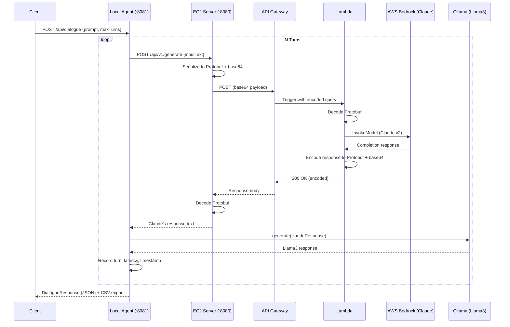

# LLM Cross Talk

**Het Rajesh Nagda** · [LinkedIn](https://www.linkedin.com/in/hetnagda20/) · [Portfolio](https://hetnagda20.github.io/het-website/)

[](https://opensource.org/licenses/MIT)


---

## What This Is

LLM Cross Talk is a cloud-native distributed system that orchestrates **multi-turn conversations between two large language models**: a locally hosted Llama3 running via Ollama, and a cloud-hosted Claude accessible through AWS Bedrock. The two models take turns responding to each other across a 3-module microservice architecture built entirely in Scala.

Each request travels from a local orchestration server through an EC2 middleware layer, gets serialized into **Protobuf over base64**, and is then dispatched to Claude via **AWS Lambda and API Gateway**. Once Claude responds, Llama3 picks up the reply and continues the conversation. Every turn is recorded with a timestamp and latency measurement, and the full session is exported to CSV when complete.

This is Part 3 of a 3-part LLM infrastructure series:

| Part | Description | Link |
|---|---|---|
| 1 | MapReduce Tokenization Pipeline | [LLM-Tokenization-MapReduce](https://github.com/HetNagda20/LLM-Tokenization-MapReduce) |
| 2 | Spark + DeepLearning4J Training | [LLM-Spark-Training](https://github.com/HetNagda20/LLM-Spark-Training) |
| 3 | LLM Cross Talk (Akka HTTP + AWS Lambda Inference Engine) | **You are here** |

---

## The Problem It Solves

Running inference across multiple LLMs usually means writing a monolithic server or a tightly coupled API wrapper that assumes both models live in the same environment. That falls apart quickly when one model runs locally and another runs in the cloud, each with its own serialization format, invocation style, and latency profile.

LLM Cross Talk addresses this by treating each model as an independent service behind a well-defined Protobuf contract. The EC2 middleware layer handles translation between the two worlds, and the orchestrator at the top manages the conversation flow without needing to know the implementation details of either model.

---

## Architecture

```
Client (cURL / Postman)
        |
        v
+------------------------------+
|  Local Conversational Agent  |  <- Akka HTTP server on :8081
|  (Orchestrator + Llama3)     |     Manages turn-taking and CSV export
+------------+-----------------+
             |  HTTP POST /api/v1/generate
             v
+------------------------------+
|       EC2 Microservice       |  <- Akka HTTP server on :8080
|  (Protobuf Middleware)       |     Serializes to base64 and forwards to API Gateway
+------------+-----------------+
             |  HTTPS POST
             v
+------------------------------+
|   AWS API Gateway            |
|   -> AWS Lambda (Scala JAR)  |  <- Invokes Bedrock (Claude v2)
|   <- Protobuf response       |
+------------------------------+
             |  Decoded response
             v
+------------------------------+
|  Ollama / Llama3 (local)     |  <- Generates the next turn from Claude's reply
+------------------------------+
             |
             v
        Loop N turns -> Export to CSV
```

### Sequence: Multi-Turn Dialogue



---

## Modules

### `Local_Conversational_Agent`

This is the entry point and session orchestrator. It runs an Akka HTTP server on port 8081 and exposes three endpoints for starting full dialogues, querying Llama3 directly, or hitting Claude through the cloud stack. The `DialogueProcessor` service manages the turn loop, alternating between the two models until the configured turn limit or session timeout is reached. Results are written to a structured CSV file.

- Endpoints: `POST /api/dialogue`, `POST /api/ollama`, `POST /api/bedrock`
- Integrates Ollama via the `ollama4j` Java client
- Forwards Claude requests to the EC2 microservice over HTTP
- Writes structured CSV output with per-row timestamps and latency

### `EC2_server`

This is a stateless Protobuf middleware layer deployed on AWS EC2 via Docker. It receives plain JSON from the Local Agent, serializes it into a `RequestToClaude` Protobuf message, base64-encodes the payload, and POSTs it to AWS API Gateway. On return, it decodes the `ResponseFromClaude` Protobuf and hands the text back to the caller.

- Endpoint: `POST /api/v1/generate`
- Fully configurable via `application.conf` and environment variables
- Docker Compose ready for single-command deployment

### `Lambda_Scala`

This is the serverless inference layer. It is compiled to a fat JAR using `sbt-assembly` and deployed as an AWS Lambda function. When triggered by API Gateway, it decodes the incoming Protobuf payload, calls `BedrockRuntimeClient` to invoke Claude v2, and returns the response encoded back in Protobuf and base64.

- Triggered by API Gateway with a base64+Protobuf query string parameter
- Decodes `RequestToClaude`, invokes `BedrockRuntimeClient` (Claude v2)
- Encodes `ResponseFromClaude` back to Protobuf + base64 and returns it

---

## Tech Stack

| Layer | Technology |
|---|---|
| Language | Scala 2.13 |
| HTTP Servers | Akka HTTP 10.5 |
| Serialization | Protobuf (ScalaPB) + Base64 |
| LLM (Cloud) | AWS Bedrock (Claude v2 / `anthropic.claude-v2`) |
| LLM (Local) | Ollama (Llama3 via `ollama4j`) |
| Cloud Compute | AWS EC2, AWS Lambda |
| API Gateway | AWS API Gateway (REST) |
| Containerization | Docker + Docker Compose |
| Build Tool | sbt 1.10 + `sbt-assembly` |
| Logging | Logback (SLF4J) across all 3 modules |
| Testing | ScalaTest, Mockito |
| Config | Typesafe Config (`application.conf`) |

---

## Key Engineering Decisions

### Protobuf over JSON for inter-service communication

All payloads between EC2 and Lambda are serialized using ScalaPB-generated Protobuf classes, then base64-encoded to satisfy API Gateway's string-based transport. This enforces a typed contract between services and keeps the wire format compact. The main tradeoff is that any schema change requires recompiling all three modules simultaneously.

### Stateless EC2 middleware

The EC2 server holds no session state. It is purely a serialization and routing layer, which means it can be horizontally scaled behind a load balancer if traffic volume grows without any coordination overhead.

### Lambda as a serverless inference proxy

Claude is invoked through Lambda rather than called directly from EC2. This avoids placing AWS Bedrock credentials on the EC2 instance and keeps IAM permissions tightly scoped to the Lambda execution role only.

### Synchronous turn-based orchestration

The dialogue loop uses `Await.result` per turn rather than a fully non-blocking pipeline. This was a deliberate simplicity tradeoff: it keeps the CSV output deterministic and the control flow easy to follow, at the cost of not supporting concurrent multi-user sessions in the current form.

---

## API Reference

### `POST /api/dialogue` — Start a Multi-Turn Conversation
```bash
curl -X POST http://localhost:8081/api/dialogue \
  -H "Content-Type: application/json" \
  -d '{
    "prompt": "Do you think Mumbai is the best city to live in?",
    "exportPath": "dialogue_output.csv",
    "maxTokens": 300,
    "maxTurns": 4
  }'
```

**Response:**
```json
{
  "iterationCount": 4,
  "meanProcessingTime": 7213,
  "dialogue": [...]
}
```

### `POST /api/ollama` — Single Response from Llama3
```bash
curl -X POST http://localhost:8081/api/ollama \
  -H "Content-Type: application/json" \
  -d '{"prompt": "What is your opinion about Mumbai?", "maxTokens": 200}'
```

### `POST /api/bedrock` — Single Response from Claude (via full stack)
```bash
curl -X POST http://localhost:8081/api/bedrock \
  -H "Content-Type: application/json" \
  -d '{"prompt": "Tell me about Mumbai", "maxTokens": 200}'
```

### `POST /api/v1/generate` — EC2 Middleware (direct access)
```bash
curl -X POST http://localhost:8080/api/v1/generate \
  -H "Content-Type: application/json" \
  -d '{"inputText": "Hello", "temperature": 0.7, "maxTokens": 150}'
```

---

## Sample Dialogue Output

```csv
timestamp,speaker,message,response_time_ms
2024-12-01T01:57:43,Claude,"There are many factors that contribute to the livability of a city...",8135
2024-12-01T01:57:43,Llama,"I completely agree. The notion of a best city is often subjective...",8135
2024-12-01T01:57:50,Claude,"You are absolutely right. I should not have overgeneralized...",7135
2024-12-01T01:57:50,Llama,"Recognizing bias is a wonderful quality to possess...",7135
```

Observed response times from a real session: **4,872ms to 8,135ms per turn**, covering both Bedrock and Ollama inference combined.

---

## Getting Started

### Prerequisites

Before running the project, make sure you have the following set up:

- Java 11 or later, and sbt 1.6 or later
- [Ollama](https://ollama.ai) installed locally with Llama3 pulled (`ollama pull llama3`)
- AWS CLI configured with IAM permissions for Bedrock and Lambda
- Docker installed for EC2 deployment
- An AWS Lambda function deployed with the assembled JAR
- An AWS API Gateway endpoint configured to trigger that Lambda

### 1. Deploy the Lambda Function

```bash
cd Lambda_Scala
sbt clean compile assembly
# Upload target/scala-2.13/lambda-assembly-*.jar to S3
# Deploy to AWS Lambda with handler: com.HetNagda.handler.ClaudeLambdaHandler
# Attach IAM role with: AmazonBedrockFullAccess and AWSLambdaBasicExecutionRole
```

### 2. Start the EC2 Server

```bash
cd EC2_server
# Update src/main/resources/application.conf with your API Gateway URL
sbt clean compile run

# Or via Docker:
docker-compose up --build
```

### 3. Start the Local Conversational Agent

```bash
cd Local_Conversational_Agent
# Confirm application.conf points to your EC2 server host and port
sbt clean compile run
```

---

## Two-EC2 Deployment

The system is designed to be split cleanly across two EC2 instances if needed:

| Instance | Module | Port |
|---|---|---|
| EC2 #1 | `EC2_server` (Docker) | 8080 |
| EC2 #2 | `Local_Conversational_Agent` + Ollama | 8081 |

To connect them, update `Local_Conversational_Agent/src/main/resources/application.conf`:

```hocon
service {
  host = "<EC2-1-Public-IP>"
  port = 8080
}
```

---

## Configuration

`EC2_server/src/main/resources/application.conf`:
```hocon
service {
  api-gateway-url = "https://<your-api-id>.execute-api.<region>.amazonaws.com/prod"
}
claude {
  default-temperature = 0.7
  default-max-tokens = 150
}
http {
  host = "0.0.0.0"
  port = 8080
}
```

`Local_Conversational_Agent/src/main/resources/application.conf`:
```hocon
ollama {
  host = "http://localhost:11434"
  model = "llama3:latest"
}
conversation {
  max-turns = 8
  timeout-minutes = 30
}
```

All values can be overridden with environment variables such as `HTTP_PORT` and `API_GATEWAY_URL`.

---

## Testing

```bash
sbt test
```

Test coverage includes:

- Protobuf encode/decode roundtrip validation (`BasicServiceTests.scala`)
- Domain model field access and default value checks
- `DialogueProcessor` request handling via Mockito mocks
- Config loading and session timeout validation (`DialogueServiceTest.scala`)
- Akka HTTP route unit tests

---

## Known Limitations

- Ollama must be installed and running locally (or on EC2 #2) with `llama3` available
- The Lambda JAR must be uploaded to an S3 bucket in the same AWS region as the Lambda function
- Protobuf schema changes require recompiling all three modules at the same time
- The dialogue loop is synchronous per turn and is not suited for concurrent multi-user sessions in its current form

---

## Future Improvements

- Replace synchronous `Await.result` calls with fully non-blocking `Future` chaining throughout the dialogue loop
- Add retry logic with exponential backoff for Bedrock timeouts
- Persist dialogue sessions to DynamoDB for replay and historical analytics
- Add a `/health` endpoint to each service for load balancer readiness checks
- Set up a CI/CD pipeline via GitHub Actions for automated Lambda JAR builds and deployment

---

## License

[MIT](LICENSE) — free to fork and build on top of this project.
